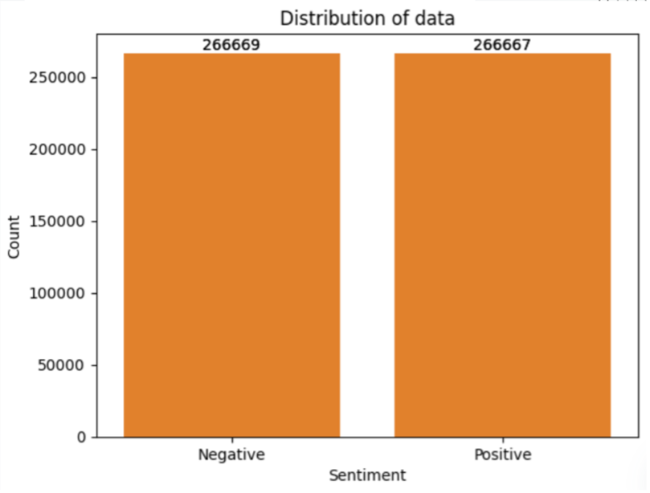
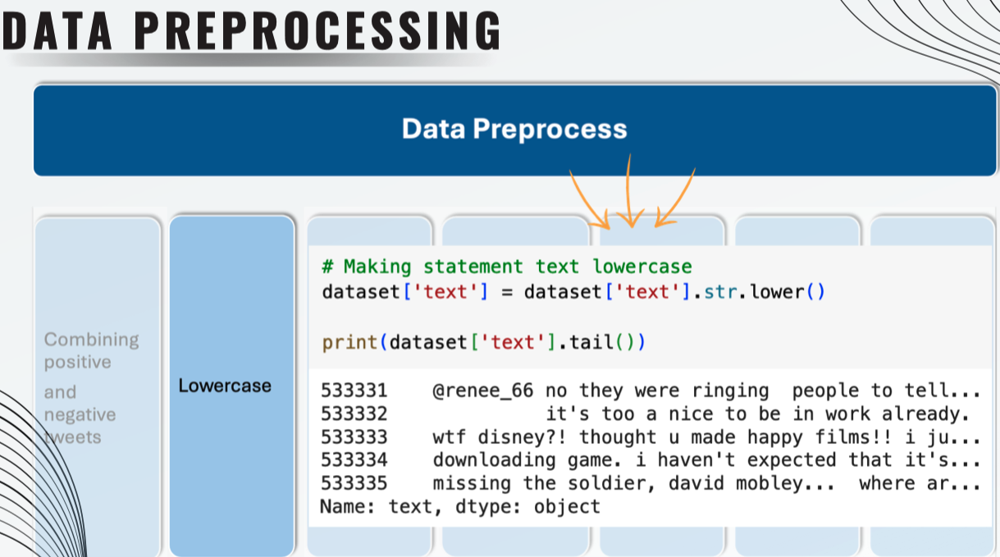
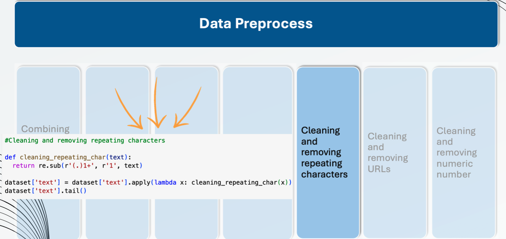
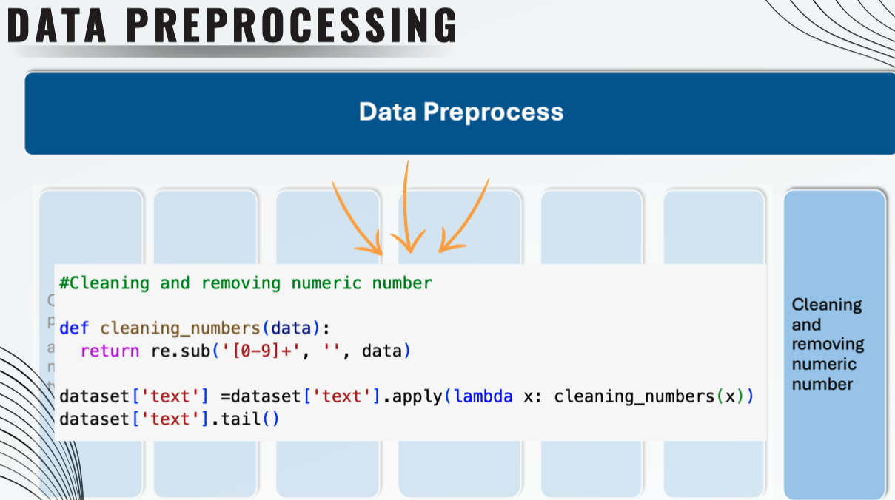

# Twitter-Sentiment-Analysis

Using python to do a twitter sentiment analysis

Dataset from kaggle:
[Sentiment140 dataset with 1.6 million tweets](https://www.kaggle.com/datasets/kazanova/sentiment140)

In this project, it is aim to analyze Twitter sentiment analysis Dataset using machine learning algorithms, the sentiment of tweets provided from the **Sentiment140 dataset** by developing a machine learning pipeline involving the use of three classifiers (**Logistic Regression, Bernoulli Naive Bayes, and SVM**)along with using **Term Frequency- Inverse Document Frequency** (**TF-IDF)**. The performance of these classifiers is then evaluated using **accuracy** and **F1 Scores**.

For data preprocessing, we will be using Natural Language Processing’s (NLP) NLTK library.

Data view:

---

---

Output: 

